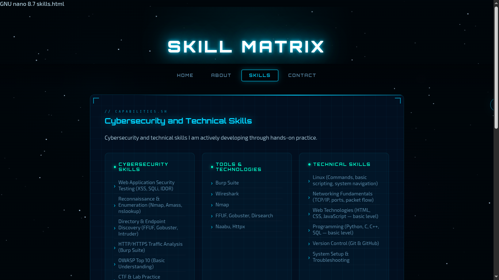
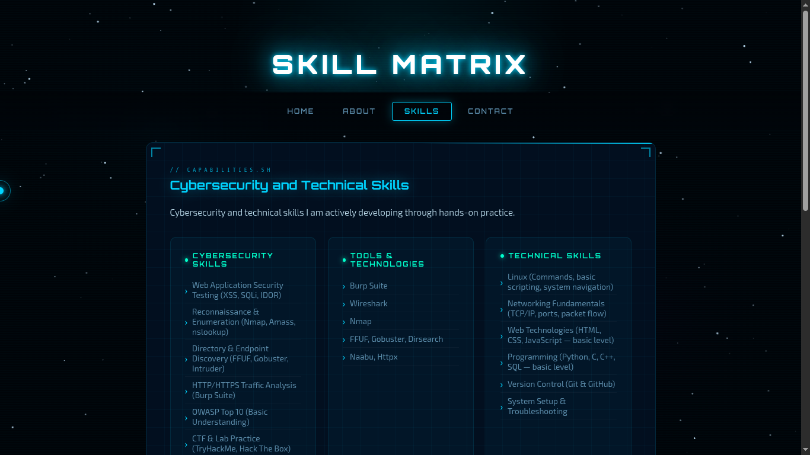
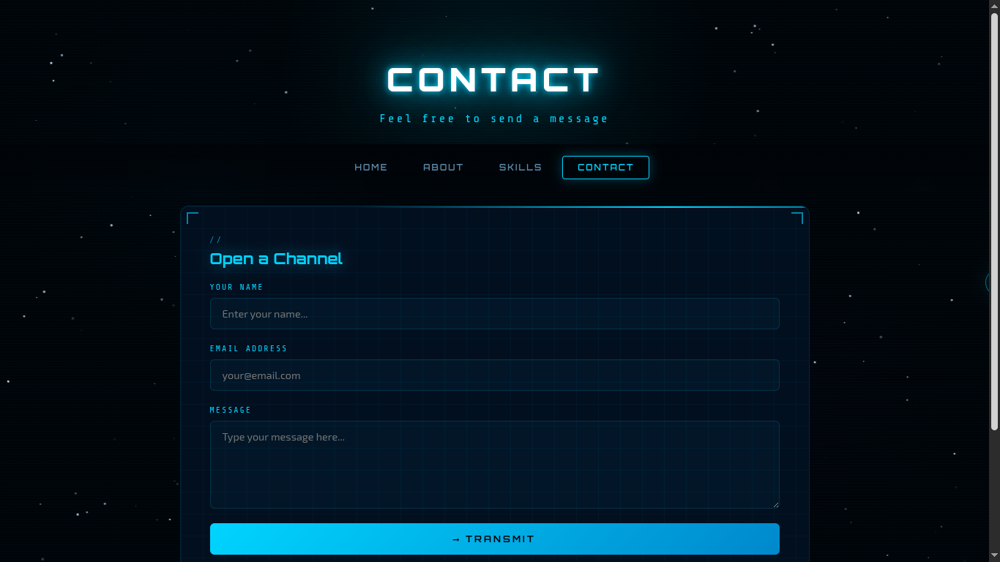
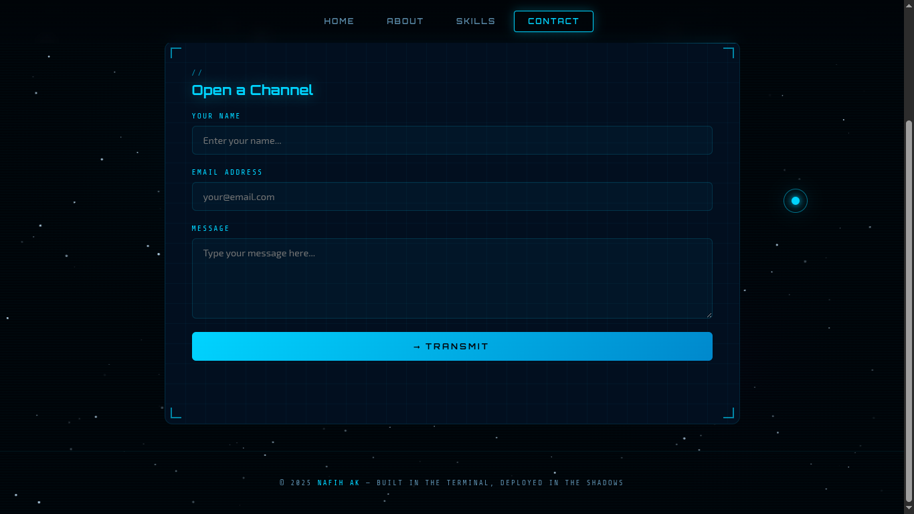
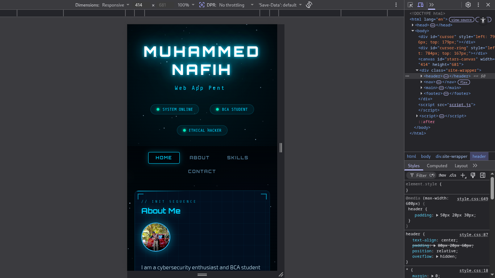
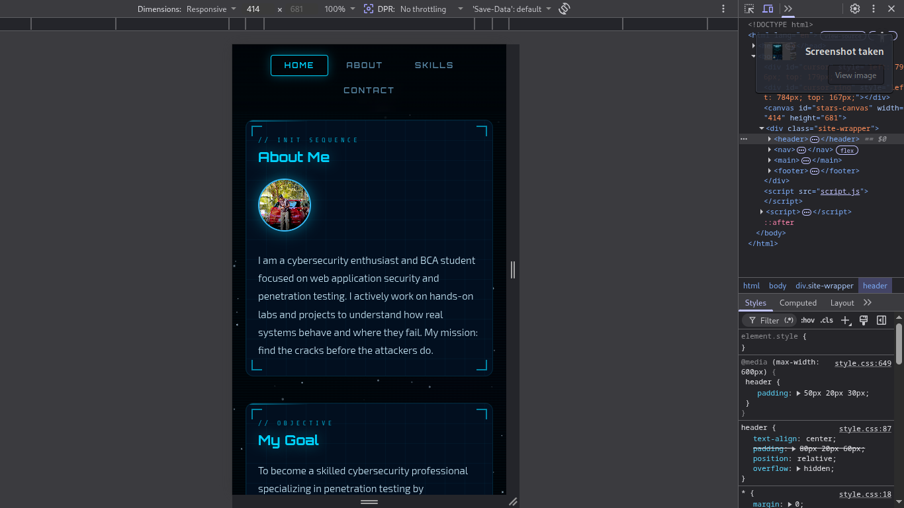

# 🔐 SecureProfile – Cybersecurity Portfolio Website

## 🌐 Live Demo
https://nafee7h.github.io/Cybrexa_01_SecureProfile/

---

## 📌 Overview

A cybersecurity-focused personal portfolio website built to demonstrate practical skills in web development and secure coding.

This project showcases my learning journey in ethical hacking, web application security, and penetration testing, along with basic security implementations.

---

## 🚀 Features

- Multi-page portfolio (Home, About, Skills, Contact)
- Dark-themed UI with animations and interactive effects
- Typing animation and dynamic UI elements
- Profile avatar integration
- Fully deployed using GitHub Pages

---

## 🔑 Key Highlights

- Built a complete portfolio website from scratch
- Implemented client-side input validation
- Applied basic XSS (Cross-Site Scripting) prevention
- Organized clean project structure
- Successfully deployed the project live

---

## 🔐 Security Implementation

- Input sanitization to prevent script injection
- Basic protection against XSS attacks
- Client-side validation for user inputs

---

## 🧠 Skills Demonstrated

### Cybersecurity
- Web Application Security (XSS, SQL Injection basics, IDOR awareness)
- OWASP Top 10 (basic understanding)
- Reconnaissance concepts

### Technical
- HTML, CSS, JavaScript
- Linux fundamentals
- Networking basics
- Git & GitHub

---

## 🛠️ Technologies Used

- HTML5
- CSS3
- JavaScript
- Git & GitHub
- GitHub Pages

---

## 📂 Project Structure
Cybrexa_01_SecureProfile/
│
├── index.html
├── about.html
├── skills.html
├── contact.html
│
├── style.css
├── script.js
│
├── images/
│ ├── profile.jpg
│ ├── skill/
│ ├── contact/
│ └── mobile_view/
│
├── README.md
├── SECURITY.md

---

## 📸 Screenshots

### Home

### Skills

### Contact

### Mobile View

---

## 🎯 Goal

To build a practical cybersecurity portfolio demonstrating both development and secure coding fundamentals.

---

## 🔮 Future Improvements

- Add backend functionality for contact form
- Improve security implementations
- Add real project showcase section

---

## 🔗 Links

- 🌐 Live: https://nafee7h.github.io/Cybrexa_01_SecureProfile/
- 💻 GitHub: https://github.com/nafee7h/Cybrexa_01_SecureProfile

---

## 👨‍💻 Author

Muhammed Nafih  
Cybersecurity Student | Aspiring Penetration Tester  

---

## ⭐ Note

This project is part of my cybersecurity internship and learning journey, focused on building practical, real-world skills.
